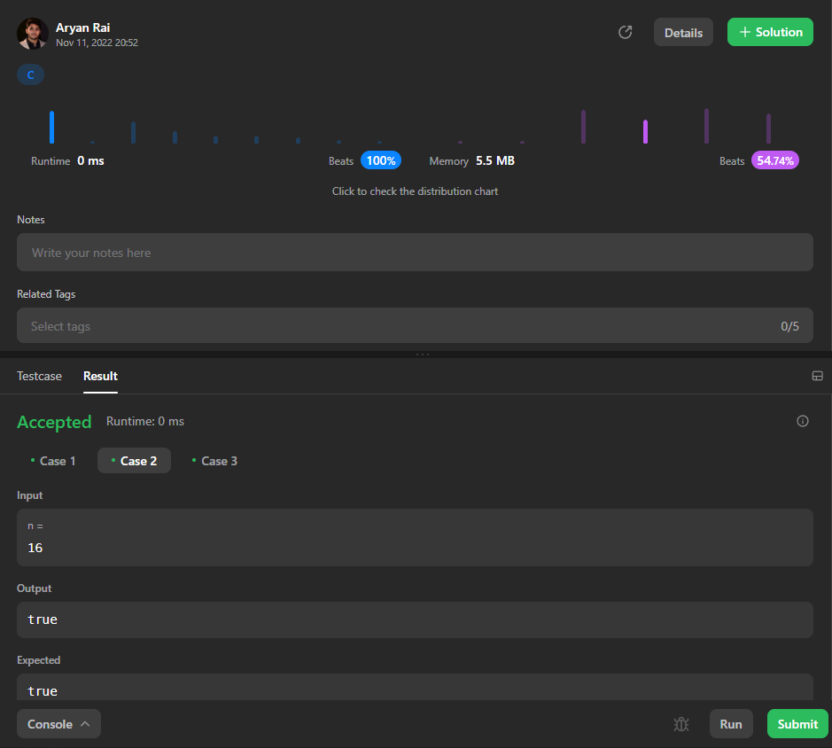
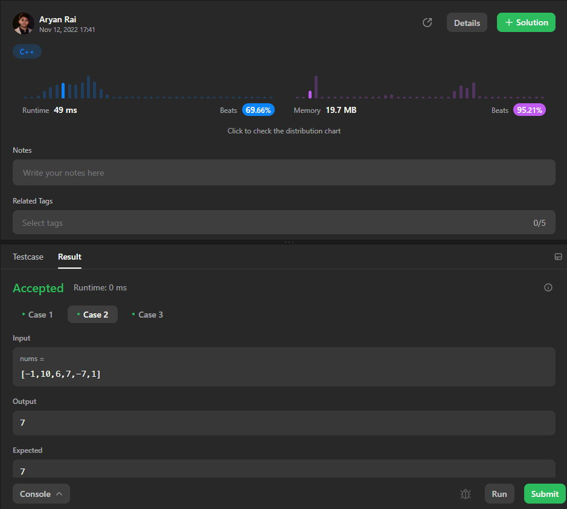
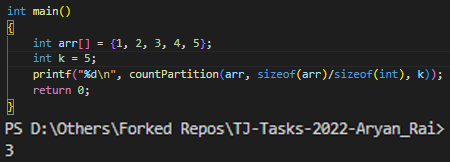
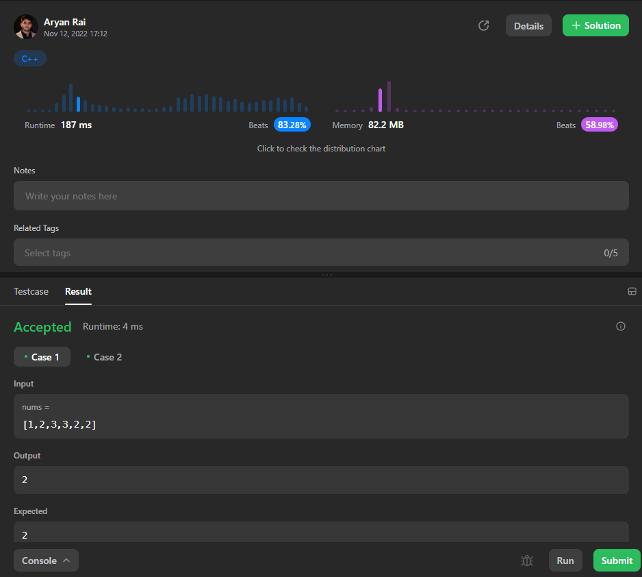

# DSA/CP Track:

## **Easy:**
* [Power of 2](/Solutions/1-Easy/1.c) \
    **Explaination** : I started with approach that uses logs to check if the given number is a power of 2. But it did not work on larger numbers because of the precision. So I tried something new by maipulating the bit architecture of an integer using pointer casting. I exploited the IEEE Standard 754 and used bit manipulation to make sure that the output is accurate and consistent.
    

* [Negative-Positive Existential Crisis](/Solutions/1-Easy/2.cpp) \
    **Explaination** : Initially I am sorting the array with a custom comparator function that only looks at the absolute value, this makes sure that every number and its negative are together. Then I am iterating through the array in pairs. I keep track of a maximum number in a variable and I update that maximum upon encountering a pair with sum 0. Then I return the maximum.
    

* [Are there common factors?](/Solutions/1-Easy/3.c) \
    **Explaination** : At first I am sorting the numbers so a is smaller and b is bigger, and then I am simply running a loop from 2 to the smaller number that is a. In the loop I am just checking if both the numbers are divisible by iterator, and if so, I am incrementing a counter variable that starts from 1 to account for 1 as a common factor. Then I return this counter.
    

* [69-Problems](/Solutions/1-Easy/4.cpp) \
    **Explaination** : I tried solving this problem in Java using string to simply replace the first 6 with a 9. But that solution was slow and consumed memory, so I switched to C++. Then I converted the number to floating point and kept dividing it by 10 till it was smaller than 1 and then I kept multiplying it by 10 till a 6 was encountered and I simply added 3 and continued multiplication till I got back all the digits. And lastly I converted the number back to integer and returned.
    

* [Array Partition](/Solutions/1-Easy/5.c) \
    **Explaination** : Starting from the 1st index I ran a loop through the array and inside the loop I ran 2 nested loops to select the maximum value from the left side of my current interator index and minimum value from the right side. Then I simply add the two and check if it is greater than k. If so, I increment a counter variable and return it after the loop ends.
    

---

## **Medium:**
* [Subarray with max bitwise](/Solutions/2-Medium/1.cpp) \
    **Explaination** : This solution is driven by the intuition that the maximum AND will always be with maximum value in the array. So I simply solved the problem of finding the largest subarray full of the element with the maximum value in the array. To do this I first found the maximum value and then simply ran a loop to find the longest string of that value and returned its length.
    

* [Minimum divison of groups](/Solutions/2-Medium/2.c) \
    **Explaination** : N/A

* [Popular youtube creators](/Solutions/2-Medium/3.c) \
    **Explaination** : N/A

---

## **Hard:**
* [The GRID is real](/Solutions/3-Hard/1.c) \
    **Explaination** : N/A

* [Counting the permutations](/Solutions/3-Hard/2.c) \
    **Explaination** : N/A